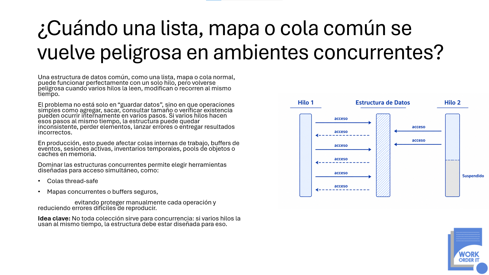

<p align="center">
  
</p>

# G6-CONCURRENT-COLLECTIONS-SAFETY-JAVA
Proyecto demostrativo en **Java** que explica por qué una estructura de datos convencional puede volverse insegura cuando varios hilos acceden o modifican su contenido simultáneamente.

El proyecto reproduce un problema de concurrencia utilizando `ArrayList` como buffer compartido y posteriormente implementa una solución utilizando `ConcurrentLinkedQueue`.

## Objetivo

Demostrar de forma práctica que una colección que funciona correctamente en un entorno de un solo hilo no necesariamente es segura cuando es utilizada simultáneamente por múltiples hilos.

El proyecto permite observar:

* Acceso simultáneo a una estructura compartida.
* Condiciones de carrera.
* Posible pérdida de elementos.
* Inconsistencia en el estado interno de una colección.
* Diferencias entre estructuras convencionales y estructuras thread-safe.
* Uso de `ConcurrentLinkedQueue` para acceso concurrente seguro.

## Problema

El escenario utiliza una lista convencional:

```java
private final List<String> events = new ArrayList<>();
```

Varios productores agregan eventos simultáneamente al mismo objeto.

```java
buffer.addEvent(
    "Producer-" + producerId + "-Event-" + j
);
```

La prueba utiliza:

```text
10 hilos
10,000 eventos por hilo
100,000 eventos esperados
```

Aunque `ArrayList` funciona correctamente en escenarios de un solo hilo, no está diseñada para modificaciones concurrentes.

Por esta razón, múltiples escrituras simultáneas pueden interferir con su estado interno y provocar:

* pérdida de elementos;
* resultados inconsistentes;
* tamaños incorrectos;
* errores difíciles de reproducir.

## Ejemplo problemático

Clase principal:

```text
ConcurrentStructureProblem
```

La estructura compartida utiliza:

```java
private final List<String> events = new ArrayList<>();
```

Después de ejecutar todos los productores se compara:

```java
int expected = numberOfThreads * eventsPerThread;

System.out.println("Eventos esperados: " + expected);
System.out.println("Eventos reales: " + buffer.size());
```

El objetivo es comprobar si la cantidad de eventos almacenados coincide con los **100,000 eventos esperados**.

## Solución

La solución sustituye `ArrayList` por una estructura diseñada específicamente para concurrencia:

```java
private final Queue<String> events =
        new ConcurrentLinkedQueue<>();
```

`ConcurrentLinkedQueue` pertenece al paquete:

```java
java.util.concurrent
```

y permite que varios hilos agreguen o consuman elementos concurrentemente sin corromper la estructura interna de la colección.

## Ejemplo solucionado

Clase principal:

```text
ConcurrentStructureSolution
```

La implementación utiliza:

```java
import java.util.Queue;
import java.util.concurrent.ConcurrentLinkedQueue;
```

y define el buffer como:

```java
static class EventBuffer {

    private final Queue<String> events =
            new ConcurrentLinkedQueue<>();

    public void addEvent(String event) {
        events.add(event);
    }

    public int size() {
        return events.size();
    }
}
```

Los mismos **10 hilos** generan **10,000 eventos cada uno**.

El resultado esperado es:

```text
Eventos esperados: 100000
Eventos reales: 100000
```

## Comparación

| Característica                     | ArrayList | ConcurrentLinkedQueue |
| ---------------------------------- | --------- | --------------------- |
| Acceso desde un solo hilo          | Sí        | Sí                    |
| Escrituras concurrentes seguras    | No        | Sí                    |
| Diseñada para concurrencia         | No        | Sí                    |
| Adecuada como buffer concurrente   | No        | Sí                    |
| Pertenece a `java.util.concurrent` | No        | Sí                    |

## Concepto principal

Una estructura de datos compartida puede convertirse en un punto crítico cuando múltiples hilos realizan operaciones simultáneamente.

Operaciones aparentemente simples como:

```text
agregar
eliminar
consultar tamaño
verificar existencia
recorrer elementos
```

pueden involucrar internamente múltiples pasos.

Si esos pasos se intercalan entre diferentes hilos, el estado de la estructura puede quedar inconsistente.

## Casos reales

Este tipo de problema puede aparecer en componentes como:

* colas internas de trabajo;
* buffers de eventos;
* sesiones activas;
* inventarios temporales;
* pools de objetos;
* caches en memoria.

## Estructura sugerida

```text
java-concurrent-collections-safety/
│
├── README.md
└── src/
    ├── ConcurrentStructureProblem.java
    └── ConcurrentStructureSolution.java
```

## Ejecución

Compilar el ejemplo problemático:

```bash
javac ConcurrentStructureProblem.java
java ConcurrentStructureProblem
```

Compilar la solución:

```bash
javac ConcurrentStructureSolution.java
java ConcurrentStructureSolution
```

## Resultado del aprendizaje

La estructura de datos debe formar parte del diseño de concurrencia de una aplicación.

No basta con compartir una colección entre varios hilos y asumir que las operaciones individuales funcionarán correctamente.

Cuando existe acceso simultáneo deben utilizarse estructuras específicamente diseñadas para ello, como las disponibles en:

```java
java.util.concurrent
```

## Idea clave

> No toda colección sirve para concurrencia. Si varios hilos utilizan una estructura al mismo tiempo, la estructura debe estar diseñada para ese patrón de acceso.

## Tecnologías

* Java
* Multithreading
* Java Collections Framework
* `ArrayList`
* `Queue`
* `ConcurrentLinkedQueue`
* `java.util.concurrent`

## Topics recomendados para GitHub

```text
java
concurrency
multithreading
thread-safety
concurrent-collections
concurrentlinkedqueue
arraylist
data-structures
race-condition
java-concurrency
```

## Autor

**Work Order IT**  
Soluciones tecnológicas, arquitectura de software y formación técnica para equipos de desarrollo.

Este repositorio forma parte de una iniciativa educativa orientada a explicar cómo la concurrencia en **Python 3.13** puede acelerar un sistema o volverlo impredecible cuando el estado compartido no se controla correctamente.

Website: [www.workorder-it.net](https://www.workorder-it.net)
